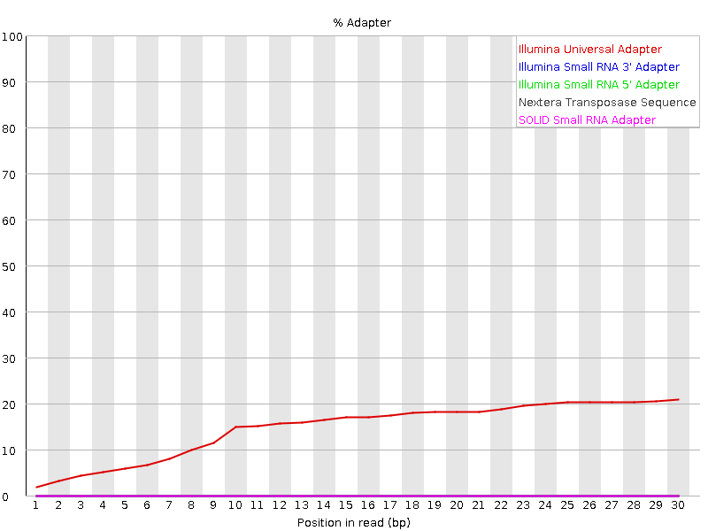

## Fastq with adapter contamination

## Trimming with the Trimmomatic tool

**java -jar Trimmomatic-0.39/trimmomatic-0.39.jar SE -phred33 -trimlog trimlog.txt B_long_1_NNNGGTTNN_1.txt.gz trimmed.fq ILLUMINACLIP:Trimmomatic-0.39/adapters/TruSeq3-SE.fa:2:30:7 MINLEN:15**

Details of all the parameters can be found in the documentation on the Trimmomatic website.

## Fastq after trimming

